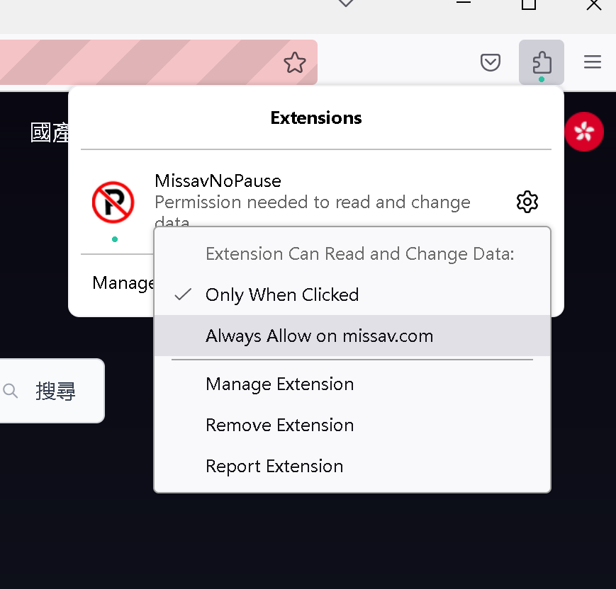
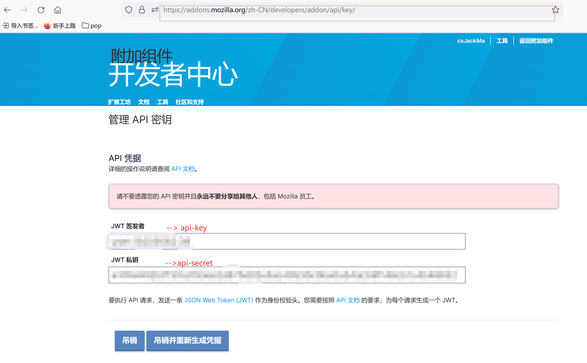

main分支：成品    dev分支：还在开发中的功能
这是一个小工具，取消av网站自动暂停，目前是一个页面一个页面的手动开发，后续有时间会做成一个小工具，可以通过添加规则的方式来自动暂停，目前只收录两个网站

# missav系列：包括thisav.com/misasv.ws(这是正版网站)/missav.ai等(missav.com是盗版网站，已经被封了)
>ps:这两个网站不知道谁抄袭谁，反正代码都一样
> 
>Missav或者thisav切换页面或者失去焦点都会自动暂停，此插件就是阻止视频自动暂停，不影响空格或者单击导致的暂停。注意：使用manifestV3实现后，可能每次需要手动授权才会运行，首次使用，如果需要授权，请选择总是允许(chrome可能不需要，firefox可能需要)，这样下次打开页面插件就会自动运行了。

# ch.cutesiangirl.net
>直接通过过滤掉scroll事件来关闭自动暂停

# javtiful.com
> 此网站idm无法发现下载链接，所以针对此网站开发了通过快捷键复制下载链接或者直接通过浏览器下载
> 
> 原理：点开一个详情页，然后点击播放按钮后才可以实现复制下载链接或者下载的功能。如果idm开启监控剪切板，那么复制下载连接的的时候idm会自动下载。idm:下载->选项->常规->监视剪切板
> 
> ctrl+shift+#：复制下载链接  ctrl+shift+$：直接通过浏览器下载

# 推荐给老色皮的组合拳
>1:firefox
> 
>2:firefox 插件(Mute sites by default):可以默认静音所有网站，除非主动开启，不过还是建议直接windows静音，以免误操作，社死
> 
>3:ublock origin: 可以自动屏蔽绝大多数色情网站的广告、弹窗，让你清爽看av
> 
>4:idm(Internet Download Manager): 淘宝三十几块钱一年，电脑安装idm后idm会自动在浏览器里添加idm扩展，基本上所有av网站的视频都可以一键下载，非常方便，不过有一点不好，自从用了idm，2tb的硬盘容量都不够了
> 
>5:视频下载器: idm下载有些网站的视频时会报错无法下载受保护的资源，此时就可以用这个开源工具了，使用很简单，看readme就行，具体网址：https://github.com/nilaoda/N_m3u8DL-CLI.git
> 
>6:letsvpn: 三百块左右一年，你还别说，这个vpn非常稳定而且下载速度非常快，如果下载源给力的话，最高可达100Mb/s足有(是100M比特，大概可达十几兆每秒的样子)，不过不建议短时间内下载几十G的av，因为会被判定为异常会被封号，需要找客服退款，然后重新注册一个账号，比较麻烦，连续下载个十几G还是可以的

# 色情网站合集
>0: xvideos.com
> 
>1: pornhub.com
> 
>2: https://noodlemagazine.com/video/welcome !!xvideos或者pornhub上许多不全的视频这上面都有，不过在线观看比较慢，一般都是xvideos上看到对应的女优，然后来这上面搜名字，然后使用idm下载，下载速度每秒五六兆左右吧
> 
>3: missav.com
> 
>4: javlibrary.com :missav上有些视频没有actress，这里面可以碰碰运气，兴许可以找到
> 
> 未完，待补充

# ！！修改代码后，下面的安装包不再同步更新，需要自己手动更新
各浏览器安装插件：
chrome：只能加载临时插件的方式加载xpi文件：
>方式一：解压xx.xpi文件，然后直接通过google浏览器加载该文件夹（不保证xx.xpi文件是最新的）:
>> google浏览器:设置->扩展程序->开发这模式->加载已解压的扩展程序
> 
>方式二：直接加载avnoPause/avNoPause文件夹
>> google浏览器:设置->扩展程序->开发这模式->加载已解压的扩展程序
>
> 
firefox：xx.xpi文件就是离线安装包，直接拖拽到firefox浏览器就行，也可以加载临时插件，直接加载avNoPause文件夹就行（如果开启隐私模式，需要允许在隐私模式下运行）,firefox默认每次都需要授权，请选择总是允许

Edge:用不了，审核不过

国产浏览器：如果是chrome系列的如360浏览器，都是使用crx文件，国产的直接拖拽crx文件到浏览器就行，如果可以用就ok，如果不可以加载crx文件（因为没有审核，所以加载以后可能不允许运行）那就只能通过加载临时插件了，步骤同chrome

firefox扩展教程：https://developer.mozilla.org/zh-CN/docs/Mozilla/Add-ons/WebExtensions/Your_first_WebExtension

firefox开发者中心：https://addons.mozilla.org/zh-CN/developers/

firefox两步验证登陆:https://support.mozilla.org/zh-CN/kb/%E7%94%A8%E4%B8%A4%E6%AD%A5%E9%AA%8C%E8%AF%81%E4%BF%9D%E6%8A%A4%E4%BD%A0%E7%9A%84%20Firefox%20%E8%B4%A6%E6%88%B7

firefox打包教程:
>1:下载npm:https://nodejs.org/en/download
>
>2:安装web-ext: npm install --global web-ext 
>
>3:进入AvNoPause/AvNoPause目录:cd 你的目录
> 
>4:允许web-ext:Set-ExcutionPolicy RemoteSigned(如果执行失败，则可以尝试先执行：Set-ExecutionPolicy -Scope CurrentUser，然后输入RemoteSigned，可以达到同样的效果)
> 
>5:删除manifest.json文件，并把manifest_firefox.json文件名修改为manifest.json文件，并修改文件内容：
>>"browser_specific_settings": {"gecko": {"id":"在这里随便填写一个新的id,格式为xx@xx"｝｝
> 
>6:运行web-ext sgin: web-ext sign --api-key "你的用户名" --api-secret "你的jwt key" --channel unlisted
> 
> 
>7:然后进入AvNoPause/AvNoPause/web-ext目录下找到xx.xpi文件，这个文件就是最新生成的firefox插件，然后拖放到firefox中就行了
 

备注：不知道为啥，在cn.javtiful.com网站上，脚本正常运行了，但是按快捷键没反应